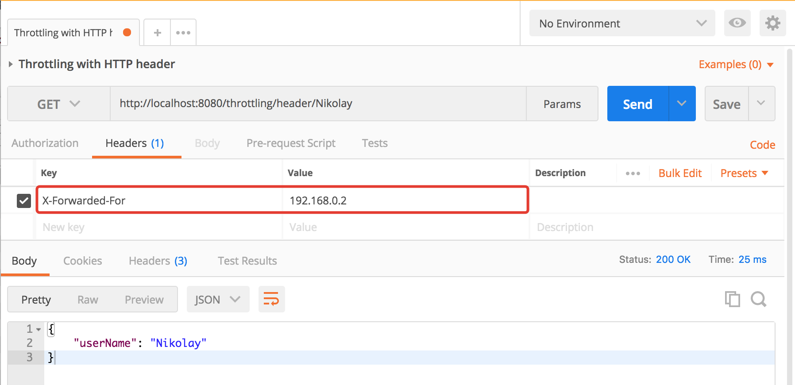

# Spring Boot Throttling
### Overview
...

Pull requests are always welcome. 

### Getting Started
...

### Samples
...

```
    @Throttling
    public void serviceMethod() {
    }
```

```
    @Throttling(limit = 3,
            timeUnit = TimeUnit.MINUTES,
            type = ThrottlingType.SpEL,
            expression = "#model.userName")
    public void serviceMethod(Model model) {
        log.info("executing service logic for userName = {}", model.getUserName());
    }
```

```
    @Throttling(limit = 24,
            timeUnit = TimeUnit.DAYS,
            type = ThrottlingType.CookieValue,
            cookieName = "JSESSIONID")
    public void serviceMethod() {
    }
```

```
    @Throttling(limit = 10,
            timeUnit = TimeUnit.HOURS,
            type = ThrottlingType.HeaderValue,
            headerName = "X-Forwarded-For")
    public void serviceMethod() {
    }
```




### License
Spring Boot Throttling is Open Source software released under the [Apache 2.0 license](http://www.apache.org/licenses/LICENSE-2.0.html).
