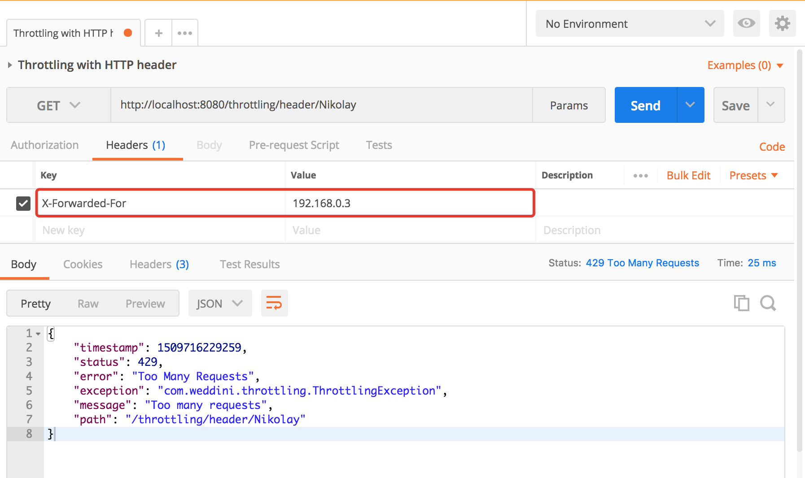

# Spring Boot Throttling
[](https://travis-ci.org/weddini/spring-boot-throttling)

### Overview

Declarative approach of throttling control over the Spring services. 
`@Throttling` annotation helps you to limit the number of service method calls per `java.util.concurrent.TimeUnit`
for a particular user, IP address, HTTP header/cookie value, or using [Spring Expression Language (SpEL)](https://docs.spring.io/spring/docs/4.3.12.RELEASE/spring-framework-reference/html/expressions.html).

Please see [example project](https://github.com/weddini/spring-boot-throttling/tree/master/spring-boot-throttling-example). Pull requests are welcome. 


### Getting Started

#### Gradle setup

Add maven repo with url https://jitpack.io to you project

```groovy
repositories {
 maven { url "https://jitpack.io" }
}

```

Add the following code to dependencies section of your build.gradle:

```groovy
compile('com.github.weddini.spring-boot-throttling:spring-boot-throttling-starter:0.0.9')
```

#### Maven setup
Add this GitHub repository to you project

```xml
<repositories>
    <repository>
        <id>spring-boot-throttling-repo</id>
        <url>https://raw.github.com/weddini/spring-boot-throttling/mvn-repo/</url>
        <snapshots>
            <enabled>true</enabled>
            <updatePolicy>always</updatePolicy>
        </snapshots>
    </repository>
</repositories>
```
Add the following code to dependencies section of your pom.xml:

```xml
<dependency>
    <groupId>com.weddini.throttling</groupId>
    <artifactId>spring-boot-throttling-starter</artifactId>
    <version>0.0.9</version>
</dependency>
```


### Samples

#### Defaults (Remote IP)
The following throttling configuration allows 1 method calls per SECOND for each unique `HttpServletRequest#getRemoteAddr()`.
This is 'defaults' for `@Throttling` annotation.

```java
@Throttling
public void serviceMethod() {
}
```
is the same as:

```java
@Throttling(type = ThrottlingType.RemoteAddr, limit = 1, timeUnit = TimeUnit.SECONDS)
public void serviceMethod() {
}
```

#### Spring Expression Language (SpEL)
The following throttling configuration allows 3 method calls per MINUTE for each unique userName in model object passed as parameter, i.e. `model.getUserName()`.

Please refer to official [docs on SpEL](https://docs.spring.io/spring/docs/4.3.12.RELEASE/spring-framework-reference/html/expressions.html).
 
```java
@Throttling(type = ThrottlingType.SpEL, expression = "#model.userName", limit = 3, timeUnit = TimeUnit.MINUTES)
public void serviceMethod(Model model) {
    log.info("executing service logic for userName = {}", model.getUserName());
}
```

#### Http cookie value
The following throttling configuration allows 24 method calls per DAY for each unique cookie value retrieved from `HttpServletRequest#getCookies()`.

```java
@Throttling(type = ThrottlingType.CookieValue, cookieName = "JSESSIONID", limit = 24, timeUnit = TimeUnit.DAYS)
public void serviceMethod() {
}
```

#### Http header value
The following throttling configuration allows 10 method calls per HOUR for each unique header value retrieved from `HttpServletRequest#getHeader('X-Forwarded-For')`.

```java
@Throttling(type = ThrottlingType.HeaderValue, headerName = "X-Forwarded-For", limit = 10, timeUnit = TimeUnit.HOURS)
public void serviceMethod() {
}
```

#### User Principal Name
The following throttling configuration allows 1 method calls per HOUR for each unique `HttpServletRequest#getUserPrincipal().getName()`.

```java
@Throttling(type = ThrottlingType.PrincipalName, limit = 1, timeUnit = TimeUnit.HOURS)
public void serviceMethod() {
}
```


### Error handling

`ThrottlingException` is thrown when method reaches `@Throttling` configuration limit. Service method won't be executed. 

```java
@ResponseStatus(code = HttpStatus.TOO_MANY_REQUESTS, reason = "Too many requests")
public class ThrottlingException extends RuntimeException {
}
```



### License
Spring Boot Throttling is Open Source software released under the [Apache 2.0 license](http://www.apache.org/licenses/LICENSE-2.0.html).
